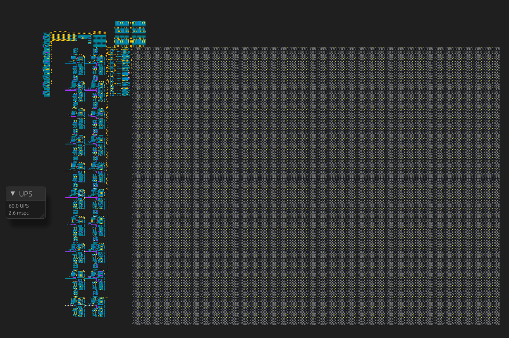
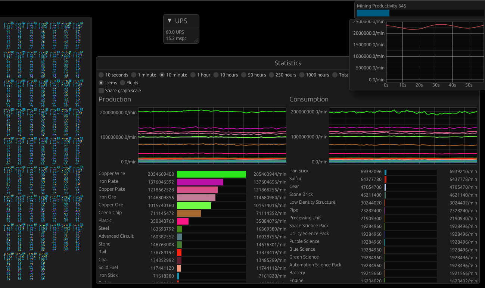
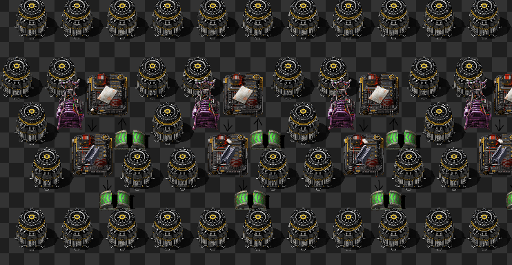
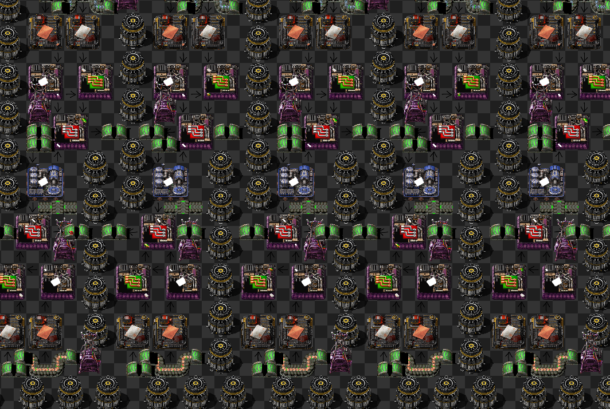

# What is this?
This project is an academic recreation of the factory game [Factorio](https://www.factorio.com/).

I created it as an exercise to see how far I could optimize the basic mechanics and algorithms of the genre in terms of performance.
Another goal that emerged along the way, was learning about the way modern CPUs actually work.

# Why did you start?
I was playing Factorio and started being unable to expand due to performance issues. So in my hubris I declared: "How hard can it be?".
I hope that the next person with this thought can find this project, and build on the ideas I have had and continue to push the performance.

# Current State
Most logic for the basic building blocks of factories are working. This allowed me to recreate a Factorio base, giving me a point for performance comparison.
I was able to run a base comprised of 60 copies of [this](https://factoriobox.1au.us/map/view/2824bc1566bd95b5825baf3bd2eb8fa32de8397526464f5a0327bcb82d64ebf8/#1/nauvis/15/2942/1158/0/447) Factorio Megabase by Smurphy (a single of which Factorio runs at ~40 UPS) at 60 UPS on my machine (Intel 12400F CPU with DDR4 3600 MT/s RAM).

### Megabase (40k SPM) with Solar

### Gigabase (60x Megabase, 2.4M SPM)

### Machines Producing Stuff

# Running it
If you only want to try it out, a web based build is available on [my website](https://aschhoff.de/projects). The performance of running in the browser is not amazing (mainly due to the browser being limited to a single thread), but it should still be able to run a 40k SPM Megabase without issue.
WASM being limited to 4GB of RAM also limits the size of the factories.

For the best experience, I advise using the native build.
It should run on Linux, Windows, MacOS as WASM (Though only Linux and WASM are tested regularly). Assuming you have [rust and cargo](https://rust-lang.org), just `cargo run --release`. On NixOS the included `flake.nix` contains the program packaged for nix, or a devshell with my VSCodium based development environment.

# How it works
I am currently working on a writeup, explaining how I designed this project and what decisions lead me to this level of performance, and which decisions I regret and might change in the future.
This writeup will be available [here](https://aschhoff.de/blog/factory-game) as soon as it is done.

# Attributions
I am not affiliated with Wube and Factorio in any way. I am just a fan, being nerdsniped by their excellent game.
All graphics used with the `graphics` feature are from the Factorio Mod [Krastorio 2 Assets](https://codeberg.org/raiguard/Krastorio2Assets).